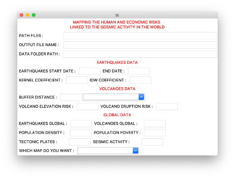

# EPF-RUDN-Seismic

This project was developed for the Geospatial Programming class of Spring 2020, an international collaboration between two universities, EPF (https://www.epf.fr/) of France and RUDN of Russia (http://www.rudn.ru). 

We are two aerospace students at EPF (https://www.epf.fr/) of France, who got the oportunity to work with ArcGIS Pro on the seismic activity around the world. This project was made possible thanks to our professor Mr Naci DILEKLI (https://github.com/ndilekli/).

The project aims to show the areas in the world that are at risks concenrning the seismic activity in the world. The 2 types of risks that were taken into account for this project are: the human risks (with the population density) and the economic risks (with the size of the urban area). To make this project even more interesting especially for people working on seismic risks, our program is highly customizable. Thus, this allow the user to completly see one phenomenon or risk according to its own criteria. 

If you want to use this project, here are the steps needed to make it run:
  - Download the zip file "DATA_SEISMIC_RISKS.zip" and store it.
  - Download the "Code_File" and open it with Jupyter Notebook from the ArcGIS folder.
  - Open ArcGIS Pro and create a new project. 
  - Read the instructions on the code file in order to see what to run first.
  - Once you have ran the code properly, a window to enter the coefficients will appear. Complete it and close it, the program will continue. 
  6 - Once the program is finished, update the files of the project in ArcGIS Pro and select the results that you need. 
  7 - You can start as many simulations with different parameters as you want !

If an error appears or something doesn't work properly, feel free to contact us by email, we will answer as soon as possible:
  - marc.schwindenhammer@epfedu.fr
  - marine.letailleur@epfedu.fr

This project is developed and updated (last update 04/30/2020) by the two conceptors : 
  - Mr Schwindenhammer Marc (marc.schwindenhammer@epfedu.fr)
  - Mrs Letailleur Marine (marine.letailleur@epfedu.fr)
